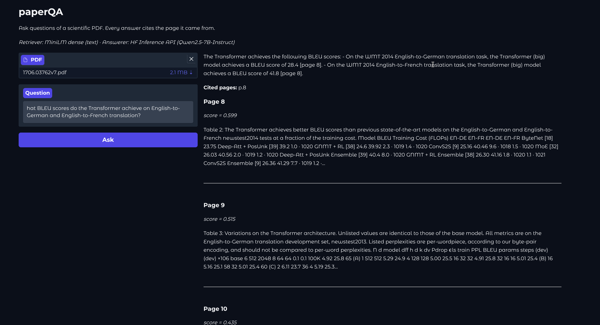

# paperQA

[](https://github.com/Joncik91/paperQA/actions/workflows/ci.yml)
[](https://huggingface.co/spaces/Joncik/paperqa)
[](https://www.python.org/)
[](LICENSE)
[](https://mypy.readthedocs.io/en/stable/)
[](https://docs.pytest.org/)
[](docs/adr/)
[](CONTRIBUTING.md)

**Ask questions of one or more scientific PDFs. Get answers grounded in the source, with the exact file and page they came from.**

> 👉 **[Try the live demo](https://huggingface.co/spaces/Joncik/paperqa)** — upload one paper or several, ask a question, see the cited pages side-by-side.



## Table of Contents

- [What It Does](#what-it-does)
- [Why It's Different From a Generic RAG Demo](#why-its-different-from-a-generic-rag-demo)
- [Headline Numbers (Attention Is All You Need, 6 questions)](#headline-numbers-attention-is-all-you-need-6-questions)
- [How It Works](#how-it-works)
- [Architectural Decisions](#architectural-decisions)
- [Running Locally](#running-locally)
- [Engineering Rules](#engineering-rules)
- [Security](#security)
- [License](#license)

## What It Does

Upload one or more papers. Type a question. Get back an answer that:

- cites the **exact file and page** it came from (`[paper.pdf, page 8]`),
- shows the **source passage** beside the answer so you can verify it,
- pools all uploaded PDFs into one normalized retrieval space so cross-document scores are directly comparable (see [ADR-0008](docs/adr/0008-multi-document-support.md)),
- never invents page numbers — citations are filtered against retrieved passages first, then through a numerical-anchor grounding check (see [ADR-0007](docs/adr/0007-citation-grounding-check.md)).

The system is tuned for arXiv-style scientific PDFs. The same pipeline works on any PDF, but the prompts and the included gold set are calibrated for academic papers.

## Why It's Different From a Generic RAG Demo

Most "chat with your PDF" demos stop at "model returns text." This project's portfolio claim is the engineering around the model:

- **Page-level citation grain** is a design decision, not an afterthought (see [ADR-0002](docs/adr/0002-chunking-strategy.md)). Every passage **is** a page; faithful citations follow by construction.
- **Pluggable backends.** `Answerer` and `Retriever` are protocols, not classes — the offline `StubAnswerer` (CI), `HFInferenceAnswerer` (live demo), and the visual `ColPaliRetriever` (CPU-only path implemented; GPU baseline parked) all satisfy the same contract.
- **Multi-document mode.** Pooled-index design ([ADR-0008](docs/adr/0008-multi-document-support.md)) means upload set is one cosine-comparable space, not N independently-normalized indexes. Single-doc behaviour is identical to before.
- **Measurement, not vibes.** [`docs/baselines/`](docs/baselines/) ships real numbers — every architecture change ships next to a recall@k / faithfulness delta. See [`docs/adr/0005-evaluation-plan.md`](docs/adr/0005-evaluation-plan.md).
- **Mature CI.** Lint + format + strict mypy + 60 unit tests on every push, across Python 3.11 and 3.12. Integration tests are gated behind `pytest -m integration` so the network never enters CI.

## Headline Numbers (Attention Is All You Need, 6 questions)

Measured on the included [`tests/eval/gold.json`](tests/eval/gold.json) gold set, with `Qwen2.5-7B-Instruct` as the answerer:

| Metric | Value | What it means |
| --- | --- | --- |
| **mean recall@3** | **0.833** | The retriever puts the right page in the top 3 on 5/6 questions |
| **mean recall@1** | 0.583 | Top-1 is less reliable — that's why default `top_k = 4` |
| **mean citation faithfulness** | **1.000** | Every emitted citation lands on a gold-relevant page |
| **must-cite rate** | **0.833** | Cited pages match the *exact* gold page (5/6 questions) |

The path to those numbers is documented as a series of baselines in [`docs/baselines/`](docs/baselines/) — every architectural change ships with the measured delta it produced.

## How It Works

1. **Ingest** — `pypdf` extracts one `Passage` per PDF page; multiple uploaded PDFs are pooled into one passage list.
2. **Index** — pages are embedded with `all-MiniLM-L6-v2`; the index is an in-memory NumPy matrix (per [ADR-0003](docs/adr/0003-embeddings-and-retrieval.md), no vector DB needed at this corpus size).
3. **Retrieve** — the question is embedded and scored against the pooled page matrix; top-k pages are returned with their source filename and page number attached.
4. **Answer** — the question + retrieved passages go to `Qwen2.5-7B-Instruct` via the HF Inference API. The system prompt forces the model to cite `[<file>, page N]` and refuse out-of-document questions.
5. **Cite** — emitted `[<file>, page N]` markers are parsed back, filtered against the retrieved set (no hallucinated references), then run through a numerical-anchor grounding check: if the answer states a number, that number must appear on the cited page or the citation is dropped with a visible annotation.

### ColPali (visual retrieval) — implemented, baseline parked

The visual-retrieval path (ColPali, [ADR-0006](docs/adr/0006-visual-retrieval-colpali.md)) targets the one measured failure case: questions about **table-heavy pages** where pypdf text extraction loses the signal (e.g. the Table 3 ablation question in the gold set, where `recall@k = 0` for every k). The implementation is in `paperqa/retrievers/colpali.py`, fully unit-tested with mocks, and gated behind a `[visual]` extra plus `PAPERQA_RETRIEVER=colpali`. **The end-to-end GPU baseline is parked** pending hardware access — DigitalOcean GPU droplets need a $250 pre-pay, HF GPU Spaces are paid, and Colab's GPU runtimes don't expose a stable URL for a Space deploy. The path is wired so a future GPU run is one `git push` away.

## Architectural Decisions

The interesting calls are recorded as ADRs, not buried in commits:

- [ADR-0001 — Scope, niche, and initial model choice](docs/adr/0001-scope-and-model-choice.md)
- [ADR-0002 — Chunking strategy: page-level passages](docs/adr/0002-chunking-strategy.md)
- [ADR-0003 — Embeddings and retrieval: MiniLM + in-memory cosine](docs/adr/0003-embeddings-and-retrieval.md)
- [ADR-0004 — Answering model and inference backend](docs/adr/0004-answering-model-and-backend.md)
- [ADR-0005 — Evaluation plan](docs/adr/0005-evaluation-plan.md)
- [ADR-0006 — Visual retrieval: ColPali behind a Retriever abstraction](docs/adr/0006-visual-retrieval-colpali.md)
- [ADR-0007 — Per-citation grounding check (post-hoc)](docs/adr/0007-citation-grounding-check.md)
- [ADR-0008 — Multi-document support: pooled index, file-prefixed citations](docs/adr/0008-multi-document-support.md)

## Running Locally

```bash
git clone https://github.com/Joncik91/paperQA.git
cd paperQA
python -m venv .venv && source .venv/bin/activate
pip install -e ".[dev,embed,llm,app]"
python app.py                 # opens Gradio on localhost:7860
```

Set `HF_TOKEN` to use the real Inference API; without it the app falls back to the offline `StubAnswerer` so the demo never hard-errors.

Full guide: [`docs/running-locally.md`](docs/running-locally.md). Deploying to a Space: [`docs/deploying.md`](docs/deploying.md).

## Engineering Rules

This is also a portfolio piece, so the discipline is part of the product. The hard rules are codified in [`CONTRIBUTING.md`](CONTRIBUTING.md):

- **DRY** on the second occurrence — no copy-paste tolerated.
- **Code comments** explain WHAT and WHY, never HOW. The code is the HOW.
- **Commit messages** are WHAT changed, WHY it changed, WHERE it landed. One logical change per commit.
- **Documentation lands in the same commit as the code it describes.** No "I'll write the docs later."

## Security

Two paths leave your machine when you run paperQA:

1. **The HF Inference API call.** When `HF_TOKEN` is set, the question
   *plus the retrieved passages from the uploaded PDFs* are sent to
   Hugging Face's inference endpoint for `Qwen2.5-7B-Instruct`. That
   means snippets of your uploaded paper(s) leave the machine on every
   answered question. Without `HF_TOKEN`, the app falls back to the
   offline `StubAnswerer` and nothing leaves the machine.
2. **The model download (one-time).** First retrieval downloads
   `all-MiniLM-L6-v2` weights (~90 MB) from the Hugging Face Hub.
   Read-only; nothing of yours is uploaded.

For proprietary or unpublished papers, run locally without `HF_TOKEN`
(stub answers, no network), or swap the answerer for a self-hosted
endpoint. The `Answerer` protocol is what makes that a one-line change
— see [ADR-0004](docs/adr/0004-answering-model-and-backend.md).

## License

MIT © Joncik91. See [LICENSE](LICENSE).
